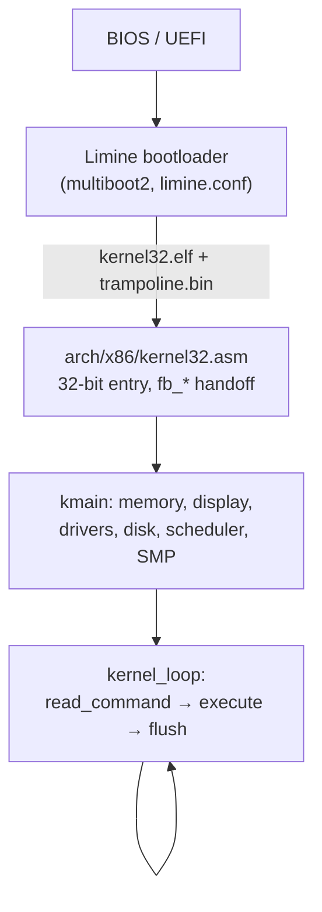

# NovumOS


A hobby 32-bit x86 operating system written in **Zig** and **NASM**.
It boots via [Limine](https://github.com/limine-bootloader/limine) into a
double-buffered graphical console with a full shell, FAT12/16/32
filesystems, preemptive SMP multitasking, Ring 3 user mode with
syscalls, an integrated scripting language (Nova) and a user-mode SDK.

## Highlights

- **Graphics console** — Linear Framebuffer with double buffering and
  dirty rectangles, dynamic resolution (`res`), VGA text emulation layer
  with wrapping and batched scrolling, serial mirror for every keystroke.
- **Shell** — tab autocomplete with LFN support, persistent history
  (`.HISTORY`), pipes (`|`) and redirection (`>` / `>>`), live clock in
  the prompt, disk selection and CWD-aware paths.
- **Filesystems** — native FAT12/16/32 over ATA PIO (both drives probed
  at boot), long file names, hidden files, in-OS `mkfs`, recursive
  `cp`/`rm`, `path_policy` sandbox for user programs.
- **Kernel** — demand paging, IDT with a watchdog, preemptive
  round-robin scheduler, SMP with work stealing, Ring 3 via `int 0x80`
  with a validated syscall table, ACPI power-off, PIT timer, RTC,
  PS/2 keyboard and mouse.
- **Nova** — two runtimes: a frozen legacy interpreter in Ring 0 and a
  modern AST-based interpreter in Ring 3 under `zig/nova_user/`.
- **SDK** — build user-mode apps in C or Zig against `libnovum`.
- **Dev** — per-architecture layout with a single seam
  (`zig/arch/mod.zig` + `zig build -Darch`), GitHub CI, docs in
  [BUILDING.md](BUILDING.md).

## Quick Start

**Requirements:** NASM, Zig 0.16, xorriso, QEMU — install details in
[BUILDING.md](BUILDING.md).

```bash
# build (Windows / Linux)
.\build.bat
./build.sh

# run
qemu-system-i386 -cdrom NovumOS.iso -serial stdio

# with a disk (create it once, format with mkfs on first boot)
cd zig && zig build mkdisk --disk-size=2G && cd ..
qemu-system-x86_64 -boot d -cdrom NovumOS.iso -hda disk.img -m 2G -serial stdio
```

## How It Boots



## Repository Layout

| Path | Contents |
|------|----------|
| `arch/x86/` | boot asm, `linker.ld` |
| `zig/arch/x86/` | exceptions, SMP, keyboard ISR, ring glue |
| `zig/arch/mod.zig` | the only arch seam — add an arch without touching core |
| `zig/kernel/` | `kmain`, memory, scheduler, ELF loader |
| `zig/shell/` | shell and command table |
| `zig/drivers/` | ATA, FAT, VGA/LFB, timer, speaker, RTC, PCI, ACPI |
| `zig/syscalls/` | `int 0x80` dispatch |
| `zig/nova_user/`, `zig/nova_legacy/` | nova runtimes (Ring 3 / Ring 0) |
| `sdk/` | user-mode SDK and examples |

## Commands

**Files** — `ls` / `la`, `cd`, `pwd`, `tree`, `cat`, `more`, `edit`,
`touch`, `mkdir` (`md`), `cp`, `mv` (`ren`), `rm`, `hexdump`, `write`,
`lseek`, `truncate`, `expand`, `forward`, `format`, `attrib`, `sync`

**Disk** — `mount`, `lsdsk`, `mkfs`, `mkfs-fat12`, `mkfs-fat16`,
`mkfs-fat32`

**System** — `help`, `about`, `fetch`, `sysinfo`, `cpuinfo`, `uptime`,
`time`, `history`, `docs`, `codename`, `clear` (`cls`), `reboot`,
`shutdown`, `ps`, `top`, `kill`, `mem`, `echo`, `calc`, `beep`

**Hardware** — `lspci`, `res`, `mouse`, `fbinfo`, `fbtest`

**Nova & scripts** — `nova`, `nova_legacy`, `exec`, `run`, `install`,
`uninstall`, `syscheck`, `hello`

**Graphics & fun** — `matrix`, `doomfire`, `qrand`

**Debug** (behind config flags in `zig/config.zig`) — `gpf`, `abort`,
`invalid_op`, `page_fault`, `panic`, `stack_overflow`, `smp-test`,
`stress-test`, `idt-check`, `idt-modify`, `idt-move`, `ring3`

Run `help` in the shell for the live list — the table is self-syncing.

## Nova Language

Statement-based scripting built into the OS: variables, arithmetic,
math helpers, filesystem access, `input()` for interactivity and
script arguments (`argc()` / `args(n)`). Scripts run either through the
legacy Ring 0 interpreter or, in `zig/nova_user/`, as Ring 3 programs
with an arena/AST pipeline. Installable as shell commands via
`install` / `uninstall`.

```nova
set string name = "NovumOS";
create_file("/greeting.txt");
```

## SDK

User-mode applications in C or Zig:

```bash
cd sdk/examples/hello_world
../../build-app.bat main.c hello.elf   # Windows
../../build-app.sh main.c hello.elf    # Linux
```

API: `nv_print`, `nv_getchar`, `nv_set_cursor`, `nv_clear_screen`,
`nv_exit`. Full reference in [sdk/README.md](sdk/README.md) and
[sdk/QUICKSTART.md](sdk/QUICKSTART.md).

## Roadmap

Shipped: graphical console, dynamic resolution, FAT12/16/32 with LFN,
preemptive SMP, Ring 3 + syscalls, demand paging, PCI enumeration,
Nova in two runtimes, SDK, CI.

Next: richer user-mode API, real audio beyond the PC speaker, a network
stack (research), and a second target architecture — the `-Darch` seam
is already in place.

## Contributing

See [CONTRIBUTING.md](CONTRIBUTING.md). Build and troubleshooting:
[BUILDING.md](BUILDING.md), [TROUBLESHOOTING.md](TROUBLESHOOTING.md).

### Author

**MinecAnton209**

### License

See LICENSE file for details.

---

**Made with ❤️ in x86 Assembly & Zig**
